# Motion Air

Usa tu **Android o iPhone como mando inalámbrico** para juegos con movimiento en **Mac o Windows**.

[Descargar Motion Air](https://github.com/cplus2jules/motion-air/releases) · [Capturas de pantalla](#capturas-de-pantalla) · [Instrucciones](#1-descarga-los-archivos) · [Read in English](README.md)

[Reportar un problema](https://github.com/cplus2jules/motion-air/issues/new?template=01-bug-report.yml) · [Dar mi opinión](https://github.com/cplus2jules/motion-air/issues/new?template=03-feedback.yml) · [Contribuir](CONTRIBUTING.es.md)

[Preguntar a la comunidad](https://github.com/cplus2jules/motion-air/discussions/new/choose) · [Crear una tarea de implementación](https://github.com/cplus2jules/motion-air/issues/new?template=04-agent-task.yml)

Motion Air sigue en pruebas. Hay comprobaciones automáticas de los botones y del envío de movimiento; la precisión de las puntuaciones de Just Dance necesita pruebas con un teléfono y un juego reales.

## Capturas de pantalla

Aquí puedes ver las apps de [iPhone](#capturas-de-iphone) y [Android](#capturas-de-android). Haz clic en una captura para verla a tamaño completo.

### Capturas de iPhone

Capturadas en un iPhone 16 Pro en modo oscuro. La interfaz de estas capturas está en inglés; las instrucciones de abajo indican los nombres de los botones que debes pulsar.

| Guía de bienvenida | Elige o conecta un equipo | Mando antes de conectar |
| --- | --- | --- |
| [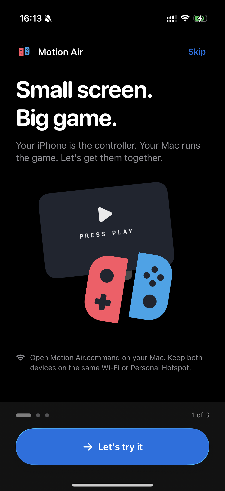](docs/images/iphone-welcome.png) | [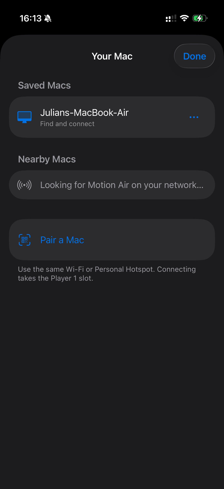](docs/images/iphone-computers.png) | [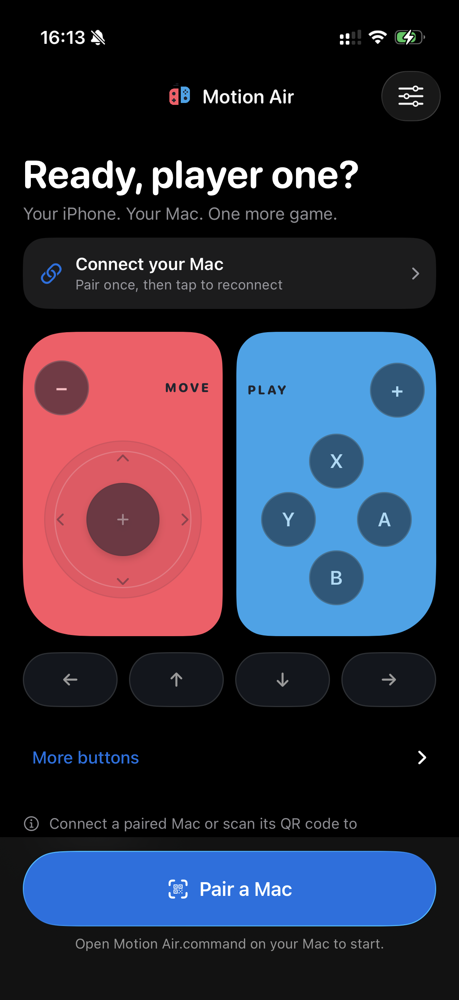](docs/images/iphone-controller-offline.png) |

### Capturas de Android

| Guía de bienvenida | Conecta tu equipo | Mando antes de conectar |
| --- | --- | --- |
| [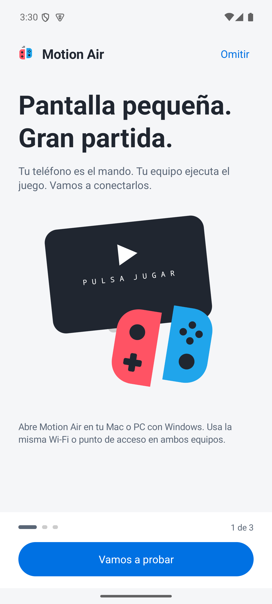](docs/images/android-welcome-es.png) | [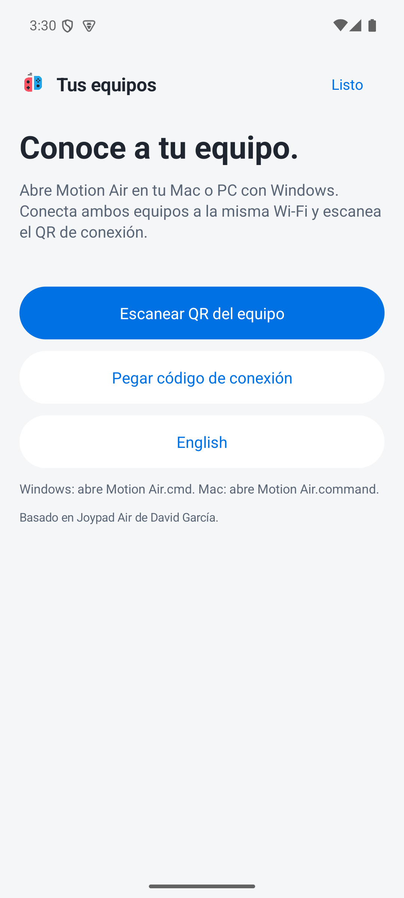](docs/images/android-pairing-es.png) | [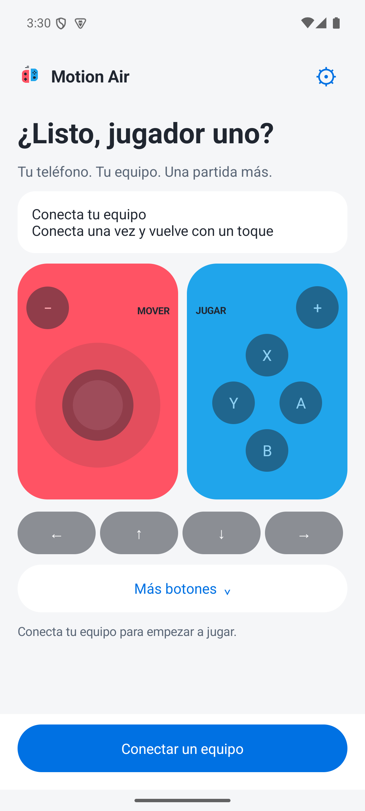](docs/images/android-controller-offline-es.png) |

Si las imágenes no aparecen en Android Studio, [abre esta guía en GitHub](https://github.com/cplus2jules/motion-air/blob/main/README.es.md#capturas-de-pantalla). Hay más capturas en los pasos de abajo.

## Qué necesitas

- Un teléfono con Android 8 o posterior, o un iPhone con iOS 17 o posterior.
- Un Mac con macOS 14 o posterior, o un PC con Windows 10/11 de 64 bits, conectado a la misma Wi-Fi que el teléfono. Los PC con procesador ARM necesitan Windows 11.
- Internet para la primera instalación en el equipo. **El lanzador instala Node.js y las dependencias de Motion Air por ti.**
- Tu emulador y juego instalados. **Just Dance necesita la versión de Ryujinx con soporte de movimiento.** Configurar solo los botones no activa el movimiento. Sigue la [guía de Mac](docs/local-device-setup.md) o la [guía de Windows](docs/windows-setup.md) para preparar el emulador.

No se incluyen juegos, emuladores, firmware ni claves de juegos.

## 1. Descarga los archivos

Usa estos enlaces para descargar las apps más recientes. También están en **Assets** de la [página de la versión](https://github.com/cplus2jules/motion-air/releases/latest).

| Para | Archivo |
| --- | --- |
| Tu Mac o PC con Windows | [Descargar para el equipo](https://github.com/cplus2jules/motion-air/releases/latest/download/MotionAir-Computer.zip) |
| Tu Android | [Descargar APK de Android](https://github.com/cplus2jules/motion-air/releases/latest/download/MotionAir-Android.apk) |
| Tu iPhone | [Descargar IPA de iPhone](https://github.com/cplus2jules/motion-air/releases/latest/download/MotionAir-iPhone-unsigned.ipa) |

Necesitas el ZIP del equipo **y** una app para el teléfono. Puedes ignorar los demás archivos. Inicia sesión en GitHub si te lo pide; este repositorio privado requiere acceso.

## 2. Instala la app del teléfono

### Android

1. Descarga el APK en tu teléfono y ábrelo desde **Descargas**.
2. Si Android lo pide, permite que el navegador o gestor de archivos **instale aplicaciones desconocidas** para esta instalación.
3. Pulsa **Instalar** y abre **Motion Air**.

### iPhone

El iPhone requiere una instalación externa, llamada **sideloading**. Una herramienta en el ordenador firma la app con tu cuenta de Apple y la instala. Abrir el IPA directamente en el teléfono no lo instala.

1. Configura tu herramienta, como [AltStore Classic](https://faq.altstore.io/) o [Sideloadly](https://sideloadly.io/), siguiendo su guía.
2. Importa el IPA descargado y sigue los pasos para firmarlo e instalarlo.
3. Abre **Motion Air** en el iPhone y permite el acceso a la **red local** cuando lo pida.

Tu método de firma determina cuándo debes renovar la app. Consulta los [detalles de instalación en iPhone](docs/ios-releases.md#download-a-build).

Ambas apps comienzan con tres lecciones breves. Pulsa **Vamos a probar** en Android o **Let's try it** en iPhone para practicar el stick, A y B sin conectar a un equipo. Estas capturas de iPhone muestran las lecciones en orden:

| 1. Bienvenida | 2. Prueba los controles | 3. Conoce el movimiento |
| --- | --- | --- |
|  | 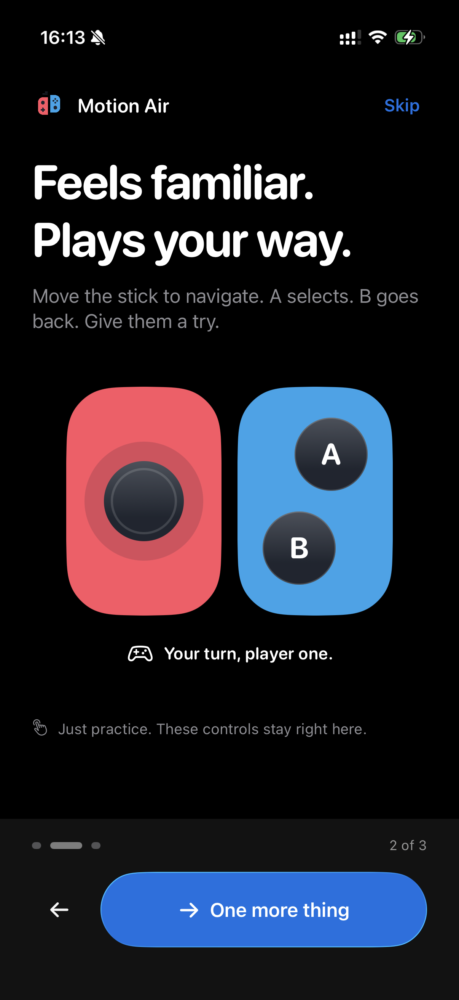 | 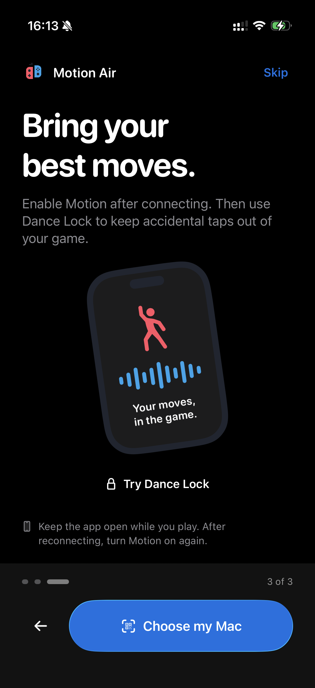 |

## 3. Abre Motion Air en el equipo

1. Extrae **todo el ZIP del equipo** en una carpeta donde puedas guardar archivos, como Documentos. En Windows, elige **Extraer todo** antes de abrir el lanzador.
2. Dentro de esa carpeta, haz doble clic en:
   - **Mac:** `Motion Air.command`
   - **Windows:** `Motion Air.cmd`
3. Espera a que termine la instalación. El lanzador descarga la versión de Node.js adecuada e instala los paquetes necesarios automáticamente. Cuando el emulador esté preparado, se abrirá una página con el QR de conexión.
4. Mantén abierta la ventana de Terminal o de comandos mientras juegas.

En Mac, permite Terminal en **Ajustes del Sistema → Privacidad y seguridad → Accesibilidad** para que los botones controlen el juego. La [guía de Mac](docs/local-device-setup.md) explica la preparación del emulador; la [guía de Windows](docs/windows-setup.md) explica cómo seleccionar tu `Ryujinx.exe`.

No necesitas instalar Node.js, npm ni un gestor de paquetes por separado. La instalación usa la carpeta de Motion Air y no necesita una cuenta de administrador. Las siguientes veces reutiliza los archivos descargados; una actualización instala las dependencias que hayan cambiado. Si una descarga falla, revisa tu conexión y vuelve a abrir el mismo lanzador.

Deja el lanzador dentro de su carpeta. Puedes crear un acceso directo o alias para el Escritorio. La instalación automática prepara el puente de Motion Air; el emulador y el juego necesitan la configuración indicada arriba. [Más sobre la instalación automática](docs/computer-setup.md#español).

## 4. Conecta el teléfono

Al terminar la guía, elige **Conectar mi equipo** en Android o **Pair my Mac** en iPhone. Si ya tienes un Mac guardado, el botón del iPhone dice **Choose my Mac**. Si omites la guía, usa el botón azul de conexión.

1. Usa la misma Wi-Fi en ambos dispositivos. Evita una red de invitados.
2. En Motion Air, escanea el QR de tu ordenador. Permite la cámara si lo pide.
3. Comprueba el nombre del equipo y confirma la conexión.
4. Haz clic en la ventana del juego y prueba los botones del teléfono.

En Android, elige **Escanear QR del equipo**. En iPhone, elige **Pair a Mac → Scan Mac QR code**, o selecciona un Mac guardado para reconectar. Si no puedes usar la cámara, pega el código del ordenador: **Pegar código de conexión** en Android o **Paste pairing code** en iPhone. En iPhone, pulsa después **Review code** y **Pair and connect**.

| iPhone: elige o conecta un Mac | Android: escanea o pega el código |
| --- | --- |
|  |  |

El stick y los botones del mando permanecen atenuados hasta conectar. Para practicar sin un equipo, abre **Ajustes → Ver guía de bienvenida → Vamos a probar** en Android, o **Controller settings → Take the welcome tour → Let's try it** en iPhone. En iPhone, desplázate hacia abajo en los ajustes para encontrar la guía.

Dónde encontrar la guía de bienvenida en iPhone

Pulsa el botón de ajustes en la esquina superior derecha del mando. Desplázate hacia abajo, pasa los datos de conexión y pulsa **Take the welcome tour**.

| Abre Controller settings | Baja hasta la guía de bienvenida |
| --- | --- |
| 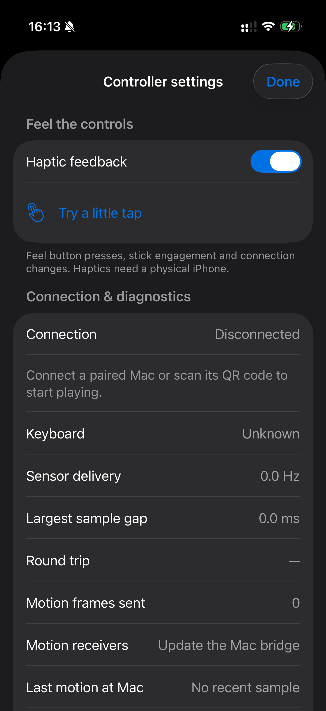 | 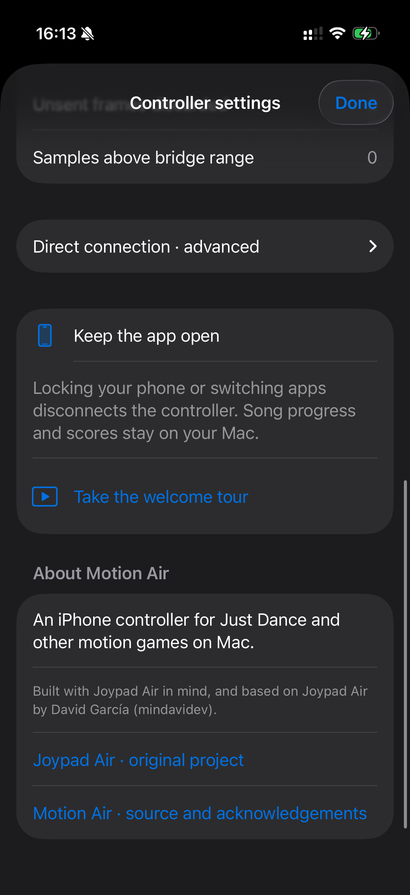 |

Solo necesitas escanear el QR la primera vez. Después, selecciona tu equipo guardado. Si cambia su dirección y no puedes reconectar, escanea un QR nuevo.

## 5. Activa el movimiento

1. Abre el juego con el emulador preparado para movimiento.
2. Pulsa **Activar movimiento** o **Enable Motion** en el teléfono.
3. Sujeta bien el teléfono en la mano derecha, en vertical y con la parte superior hacia los dedos.
4. Pulsa **Bloqueo para bailar** o **Dance Lock** para evitar pulsaciones accidentales. Mantén pulsado el botón de desbloqueo para volver al mando; en iPhone, dice **Hold to unlock controls**.

Mantén Motion Air abierto. Cambiar de app o bloquear la pantalla detiene la conexión. Tras reconectar, activa el movimiento de nuevo.

El bloqueo para bailar oculta los controles. **Enviando movimiento** indica que el receptor del equipo recibe tus movimientos; no garantiza una puntuación en el juego. La captura siguiente muestra esta pantalla en Android y en inglés: **Hold to unlock** es el botón que debes mantener pulsado para desbloquear.

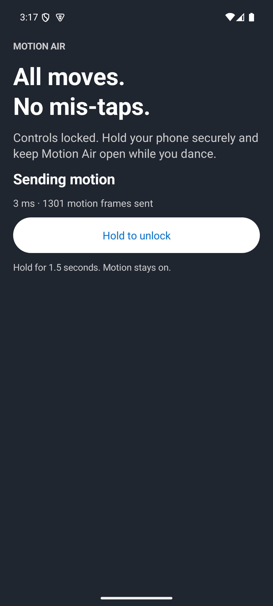

## Si algo falla

| Problema | Qué probar |
| --- | --- |
| El teléfono no conecta | Usa la misma Wi-Fi, deja abierto el lanzador y escanea un QR nuevo. En iPhone, revisa el permiso de red local. Una red de invitados puede impedir la conexión. |
| Los botones no responden | Haz clic en la ventana del juego. En Mac, revisa el permiso de Accesibilidad de Terminal. |
| Conecta, pero no hay movimiento | Activa el movimiento y comprueba que el emulador compatible esté abierto. El juego también debe recibir los datos. |
| El movimiento se detuvo al salir de la app | Abre Motion Air, reconecta y activa el movimiento de nuevo. |
| Android no instala la actualización | Usa el APK de la versión más reciente. Una app antigua de desarrollo puede tener otra firma. Consulta [actualizaciones de Android](android/README.md#updating). |
| La app de iPhone no abre | Comprueba si tu herramienta necesita renovar o volver a firmar la app. |
| La primera instalación falla | Extrae todo el ZIP en Documentos, revisa tu conexión y vuelve a abrir el lanzador. Si aún te pide instalar Node.js por separado, descarga el ZIP más reciente. |

Más ayuda: [conexión](docs/connection-reliability.md) · [estado de las pruebas de movimiento](docs/motion-implementation-status.md).

## Opiniones y contribuciones

Puedes ayudar sin programar. Cuéntanos qué funcionó, señala una pantalla confusa, mejora una traducción o propone una función. Los formularios aceptan español e inglés.

- [Reportar un error](https://github.com/cplus2jules/motion-air/issues/new?template=01-bug-report.yml)
- [Proponer una función](https://github.com/cplus2jules/motion-air/issues/new?template=02-feature-request.yml)
- [Compartir tu opinión o pedir ayuda](https://github.com/cplus2jules/motion-air/issues/new?template=03-feedback.yml)
- [Aprender a contribuir y abrir un pull request](CONTRIBUTING.es.md)

Para preguntas o ideas abiertas, usa [Discussions](https://github.com/cplus2jules/motion-air/discussions/new/choose). Para definir trabajo concreto, usa la [tarea de implementación](https://github.com/cplus2jules/motion-air/issues/new?template=04-agent-task.yml). Consulta el [flujo para colaboradores y agentes](docs/agent-workflow.md#español).

Inicia sesión en GitHub con acceso a este repositorio privado. Los issues y las conversaciones aparecen con tu cuenta. No adjuntes códigos de conexión, códigos QR ni contraseñas.

## Desarrollo

[Compilar y probar](docs/development.md) · [Publicar las dos apps](docs/mobile-releases.md) · [Otras opciones de mando](docs/controller-options.md).

## Créditos

Motion Air está basado en [Joypad Air de David García (mindavidev)](https://github.com/mindavidev/joypad-air). Esta continuación independiente conserva el copyright y la licencia MIT originales. Consulta los [agradecimientos](ACKNOWLEDGEMENTS.md) y la [licencia](LICENSE).
