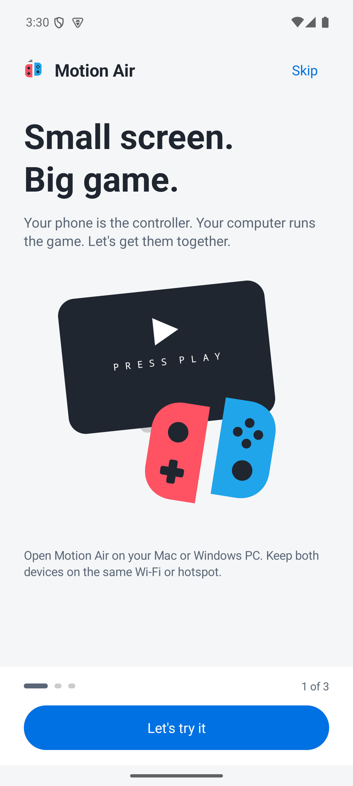
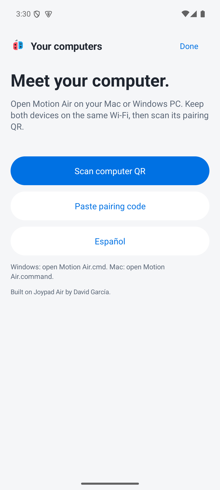
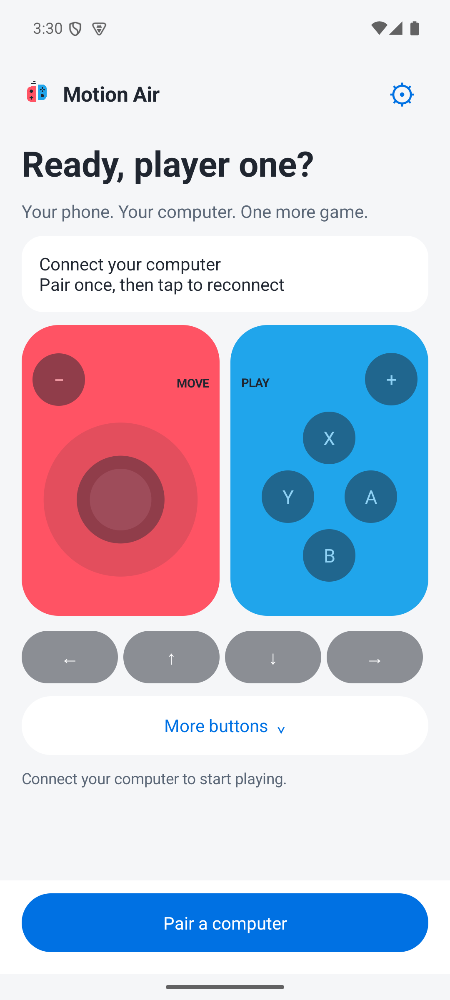

# Motion Air

Use your **Android phone or iPhone as a wireless controller** for motion games on a **Mac or Windows PC**.

[Download Motion Air](https://github.com/cplus2jules/motion-air/releases) · [Screenshots](#screenshots) · [Setup instructions](#1-download-the-right-files) · [Leer en español](README.es.md)

[Report a problem](https://github.com/cplus2jules/motion-air/issues/new?template=01-bug-report.yml) · [Send feedback](https://github.com/cplus2jules/motion-air/issues/new?template=03-feedback.yml) · [Contribute](CONTRIBUTING.md)

[Ask the community](https://github.com/cplus2jules/motion-air/discussions/new/choose) · [Create an implementation task](https://github.com/cplus2jules/motion-air/issues/new?template=04-agent-task.yml)

Motion Air is still being tested. Buttons and motion delivery have automated checks; reliable Just Dance scoring needs testing with a real phone and game.

## Screenshots

See the [iPhone](#iphone-screenshots) and [Android](#android-screenshots) apps below. Click any screenshot to open it at full size.

### iPhone screenshots

Captured on an iPhone 16 Pro in dark mode.

| Welcome guide | Choose or pair a computer | Controller before connecting |
| --- | --- | --- |
|  |  |  |

### Android screenshots

| Welcome guide | Connect your computer | Controller before pairing |
| --- | --- | --- |
|  |  |  |

If the pictures are missing in Android Studio, [view this guide on GitHub](https://github.com/cplus2jules/motion-air/blob/main/README.md#screenshots). More screenshots appear in the setup steps below.

## What you need

- An Android phone running Android 8 or later, or an iPhone running iOS 17 or later.
- A Mac with macOS 14 or later, or a 64-bit Windows 10/11 PC, connected to the same Wi-Fi as your phone. Windows PCs with an ARM processor need Windows 11.
- Internet access for the first computer setup. **The launcher installs Node.js and Motion Air's dependencies for you.**
- Your emulator and game, already installed. **Just Dance needs the motion-capable Ryujinx build.** The regular keyboard controller setup alone will not enable motion. Follow the [Mac setup guide](docs/local-device-setup.md) or [Windows setup guide](docs/windows-setup.md) for that one-time setup.

Games, emulator downloads, firmware and game keys are not included.

## 1. Download the right files

Use these links to download the latest apps. You can also find them under **Assets** on the [release page](https://github.com/cplus2jules/motion-air/releases/latest).

| For | Download |
| --- | --- |
| Your Mac or Windows PC | [Download for your computer](https://github.com/cplus2jules/motion-air/releases/latest/download/MotionAir-Computer.zip) |
| Your Android phone | [Download Android APK](https://github.com/cplus2jules/motion-air/releases/latest/download/MotionAir-Android.apk) |
| Your iPhone | [Download iPhone IPA](https://github.com/cplus2jules/motion-air/releases/latest/download/MotionAir-iPhone-unsigned.ipa) |

You need the computer ZIP **and** one phone app. You can ignore the other files. Sign in to GitHub if the repository asks you to; downloads from this private repository require access.

## 2. Install the phone app

### Android

1. Download the APK on your phone, then open it from **Downloads**.
2. If Android asks, allow your browser or file manager to **install unknown apps** for this installation.
3. Tap **Install**, then open **Motion Air**.

### iPhone

The iPhone download needs **sideloading**: a computer tool signs the app with your Apple account and installs it on your phone. Tapping the IPA on the iPhone will not install it.

1. Set up your preferred sideloading tool, such as [AltStore Classic](https://faq.altstore.io/) or [Sideloadly](https://sideloadly.io/), using its own installation guide.
2. Import the downloaded IPA into that tool and follow its signing and installation steps.
3. Open **Motion Air** on your iPhone. Allow **Local Network** access when asked.

Your signing method determines when the app needs refreshing. See [iPhone installation details](docs/ios-releases.md#download-a-build).

Both apps open with three short lessons. Tap **Let's try it** to practice the stick, A and B without connecting to a computer. These iPhone screenshots show the lessons in order:

| 1. Welcome | 2. Try the controls | 3. Learn about movement |
| --- | --- | --- |
|  |  |  |

## 3. Start Motion Air on your computer

1. Extract the **whole computer ZIP** into a folder you can write to, such as Documents. On Windows, choose **Extract All** before opening the launcher.
2. Open that folder and double-click:
   - **Mac:** `Motion Air.command`
   - **Windows:** `Motion Air.cmd`
3. Wait for setup to finish. The launcher downloads the runtime for your computer and installs the required packages automatically. After your emulator setup is ready, a browser page with a pairing QR code opens.
4. Keep the launcher's Terminal or command window open while playing.

On Mac, allow Terminal under **System Settings → Privacy & Security → Accessibility** so the phone's buttons can control the game. The [Mac guide](docs/local-device-setup.md) explains the emulator setup; the [Windows guide](docs/windows-setup.md) explains selecting your `Ryujinx.exe`.

You do not need to install Node.js, npm or a package manager yourself. Setup uses the Motion Air folder and does not need an administrator account. Later launches reuse the downloaded files; an update installs any changed dependencies. If a download fails, check your internet connection and open the same launcher again.

Keep the launcher inside its extracted folder. You can make a shortcut or Finder alias if you want it on your Desktop. The automatic setup covers Motion Air's computer bridge; your emulator and game still need the separate setup linked above. [More about automatic setup](docs/computer-setup.md).

## 4. Connect your phone

1. Keep your phone and computer on the same Wi-Fi. Avoid a guest network.
2. Open Motion Air on your phone. Follow the short welcome guide, then choose **Pair my computer** on Android or **Pair my Mac** on iPhone. If you already have a saved Mac, the iPhone button says **Choose my Mac**. If you skipped the guide, use the blue pairing button at the bottom.
3. Scan the QR shown on the computer. Allow camera access if asked.
4. Check the computer name, then confirm the connection.
5. Click the game window on your computer. Try the phone's buttons.

On Android, choose **Scan computer QR**. On iPhone, choose **Pair a Mac → Scan Mac QR code**, or tap a saved Mac to reconnect. If you cannot use the camera, use **Paste pairing code**; on iPhone, tap **Review code**, then **Pair and connect**.

| iPhone: choose or pair a Mac | Android: scan or paste a code |
| --- | --- |
|  |  |

The main controller's stick and buttons stay dimmed until you connect. To practice without a computer, reopen the welcome guide: **Settings → Show welcome guide → Let's try it** on Android, or **Controller settings → Take the welcome tour → Let's try it** on iPhone. On iPhone, scroll down in settings to find the tour.

Where to find the welcome tour on iPhone

Tap the sliders button at the top right of the controller. Scroll down past the connection details, then tap **Take the welcome tour**.

| Open Controller settings | Scroll down to the welcome tour |
| --- | --- |
|  |  |

You only need to scan the QR the first time. Later, select your saved computer. If its address changes and reconnecting fails, scan a fresh QR.

## 5. Turn on movement

1. Open your game using the motion-capable emulator setup.
2. On your phone, tap **Enable Motion**.
3. Hold the phone securely in your right hand, upright with the top toward your fingertips.
4. Tap **Dance Lock** to avoid accidental button presses. Hold the unlock button to return to the controls; on iPhone, it says **Hold to unlock controls**.

Keep Motion Air open on your phone. Switching to another app or locking the screen stops the connection. After reconnecting, tap **Enable Motion** again.

Dance Lock hides the game controls. **Sending motion** means the computer's motion receiver is getting your movements; it does not guarantee a score in the game. The screenshot below shows Dance Lock on Android.

## Something isn't working

| Problem | Try this |
| --- | --- |
| My phone cannot connect | Use the same Wi-Fi, keep the computer launcher open, and scan a fresh QR. On iPhone, check Motion Air's Local Network permission. Guest Wi-Fi may block connections between devices. |
| The stick or buttons do nothing | Pair the phone first, then click the game window. On Mac, check Terminal's Accessibility permission. |
| Connected, but movement does nothing | Tap **Enable Motion**. Check that the motion-capable emulator is running. A connected phone still needs a game listening for motion. |
| Movement stopped after I left the app | Reopen Motion Air, reconnect, and enable motion again. |
| Android says the update cannot install | Use the APK from the newest release. An older development app may use a different signing key. See [Android updates](android/README.md#updating). |
| The iPhone app will not open | Check whether your sideloading tool needs to refresh or re-sign it. |
| First-time setup failed | Extract the whole ZIP to Documents, check your internet connection, and open the launcher again. If it still asks you to install Node.js yourself, download the latest computer ZIP. |

More help: [connection troubleshooting](docs/connection-reliability.md) · [motion testing status](docs/motion-implementation-status.md)

## Feedback and contributions

You can help without writing code. Tell us what worked, report a confusing screen, improve a translation, or suggest a feature. The forms accept English or Spanish.

- [Report a bug](https://github.com/cplus2jules/motion-air/issues/new?template=01-bug-report.yml)
- [Suggest a feature](https://github.com/cplus2jules/motion-air/issues/new?template=02-feature-request.yml)
- [Share feedback or ask for help](https://github.com/cplus2jules/motion-air/issues/new?template=03-feedback.yml)
- [Learn how to contribute and open a pull request](CONTRIBUTING.md)

For questions or open ideas, use [Discussions](https://github.com/cplus2jules/motion-air/discussions/new/choose). For a defined change, use the [implementation task form](https://github.com/cplus2jules/motion-air/issues/new?template=04-agent-task.yml). See the [contributor and agent workflow](docs/agent-workflow.md).

Sign in to GitHub with access to this private repository. Issues and discussions appear under your account. Keep pairing codes, QR codes and passwords out of attachments.

## For developers

[Build and test the apps](docs/development.md) · [Publish both apps](docs/mobile-releases.md) · [Other controller options](docs/controller-options.md)

## Credits

Motion Air is based on [Joypad Air by David García (mindavidev)](https://github.com/mindavidev/joypad-air). This independent continuation retains the original MIT copyright and license. See [acknowledgements](ACKNOWLEDGEMENTS.md) and [license](LICENSE).
