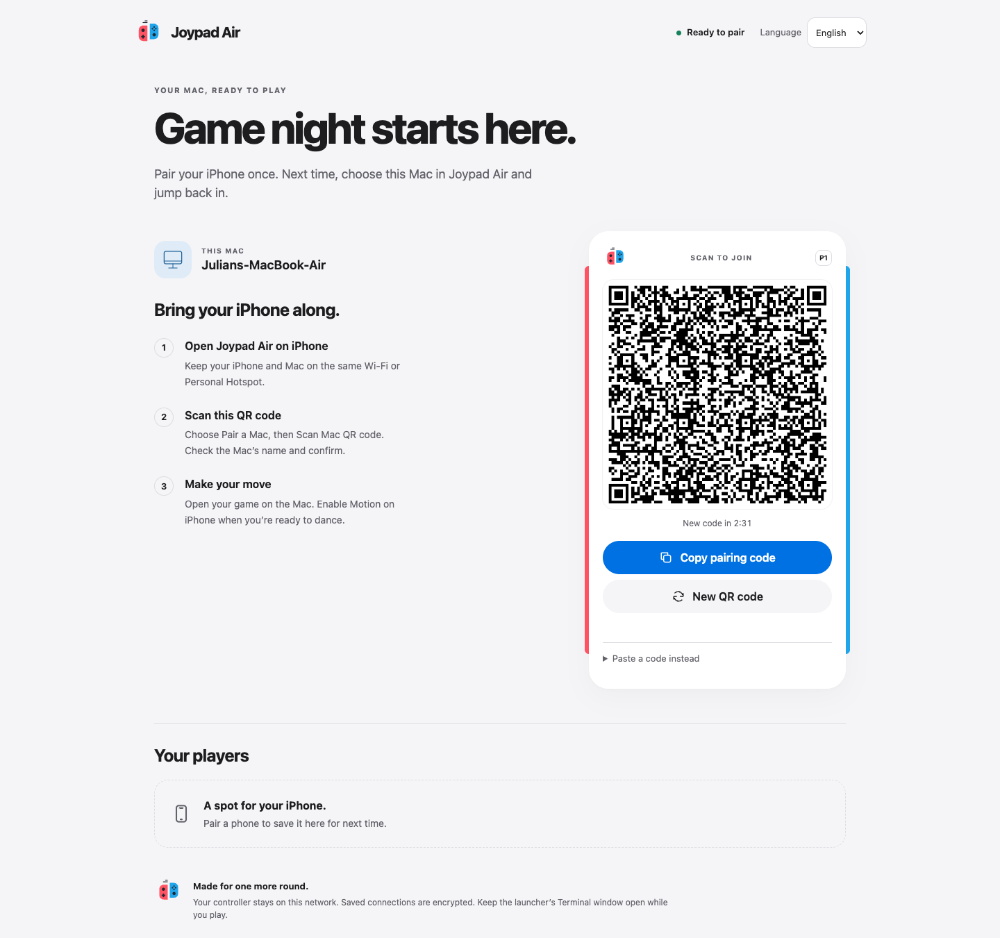
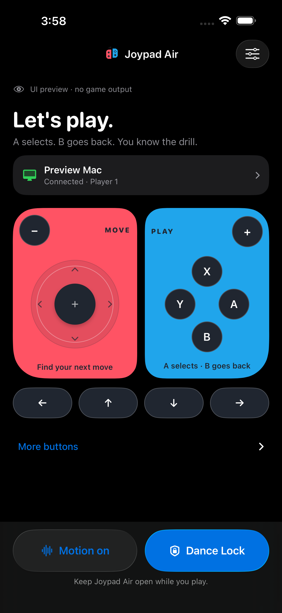
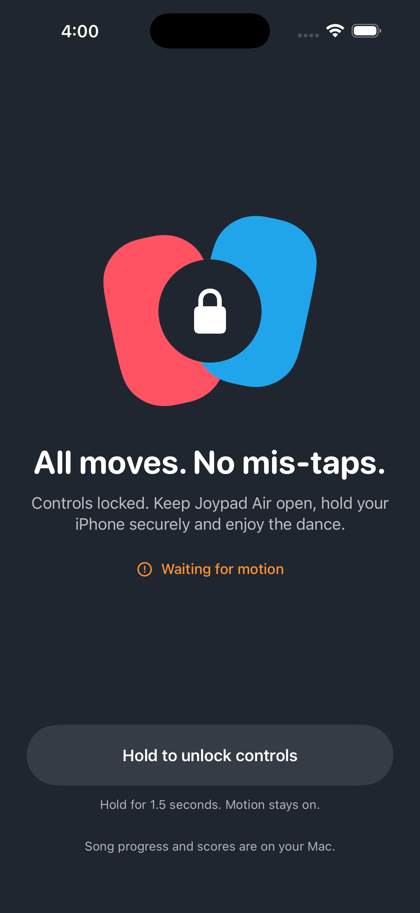

# Joypad Air UI verification

> Historical verification captured under the Joypad Air name, before the Motion Air rebrand. See [Motion Air branding](../../docs/branding.md).

Verified locally on September 9, 2026. The iPhone controller, Mac pairing page, launcher output, and Icon Composer document were implemented and inspected. Debug and Release simulator builds pass. The checks below establish UI and local transport behavior; they do not establish physical haptics, sensor quality, or game scoring.

## What changed

| Area | Before | After | Verification |
| --- | --- | --- | --- |
| Controller hierarchy | Controls shared a diagnostic form | Red/blue grips, named Mac row, separate settings and device sheets | Compact and large iPhone screenshots and interactions |
| Tactile feedback | Standard utility controls | Dark keys with immediate press feedback; joystick follows touch directly | Actual paired A/B and SL/trigger presses logged down/up |
| Motion actions | Form controls | Native Liquid Glass actions; solid fallback for Reduce Transparency | Dark, connected fixture and system accessibility settings |
| Dance Lock | Utility lock presentation | Paired-grip artwork, truthful motion freshness, deliberate unlock progress | Short hold remains locked; 1.7-second hold exits with Motion on |
| Pairing | Basic scan/paste form | Illustrated scan entry, explicit identity review and visible recovery errors | Camera-unavailable, invalid, expired and successful encrypted pairing |
| Mac launcher | Plain terminal instructions and basic pairing page | Bilingual startup stages, branded QR station, remembered phones and feedback | Actual command launch plus 38 browser checks |
| Icon | Flat vector mark | Five aligned PNG source layers and an editable Liquid Glass document | Composer Default/Dark/Mono and Xcode asset compilation |

Design decisions and the Refero sources are recorded in [reference-lock.md](reference-lock.md). The work applied the requested frontend-design, better-ui, humanizer, animate, emil-design-eng, transitions-dev, Swift, and Liquid Glass guidance. Frequent game actions have no delayed animation; copy confirmation uses a brief icon swap; unlock progress is tied to the hold gesture.

## Browser coverage — 38 passed

The repeatable script is `tools/verify-pairing-ui.mjs`; [machine-readable results](browser-verification.json) record each case. It ran with Playwright against Helium/Chromium and an isolated loopback pairing server. Seven widths (320, 375, 390, 430, 768, 1024 and 1440 CSS pixels) × English/Spanish × light/dark produced 28 layout checks. Each checked horizontal overflow, visible control height, names, image loading, document language, and heading count. No case had horizontal overflow or visible controls below 44 CSS pixels.

Ten interaction checks covered:

- Copy to the actual browser clipboard, keyboard activation, confirmation icon and translated feedback.
- Language persistence across reloads.
- Renewing an invitation through the real local API.
- Mocked saved/connected phones, long device names and HTML-like names rendered as text.
- Removal confirmation, cancellation, Escape, focus restoration and successful removal.
- Failed removal preserving the device and translating the error.
- Offline status, stale-QR hiding, disabled copy and retry recovery.
- Expired-code scan/copy prevention.
- Clipboard denial opening and selecting the manual code.
- Reduced-motion CSS, 200% text enlargement at 768px, and no uncaught browser errors.

The matrix screenshots were captured; representative desktop, 320px, dark Spanish, long-name, error and enlarged-text layouts were visually reviewed. The test distinguishes mocked device/error states from real local copy/renew/API behavior. It is not a Safari or physical camera scan test. The screenshot QR codes belong to expired isolated test invitations.

## Native coverage

Xcode 26.6 built the app for iOS Simulator 26.5 with a minimum deployment target of iOS 17. Signing the simulator build was necessary for Keychain access; an unsigned exploratory build reported a Keychain error. The signed build completed real encrypted pairing, saved its Mac in Keychain, disconnected, and reconnected without rescanning.

| Check | Evidence and result |
| --- | --- |
| iPhone 17e, 390 × 844 pt, light | Disconnected and connected controller; pairing, settings and expanded controls inspected |
| iPhone 17 Pro Max, 440 × 956 pt, dark | Connected/Motion/Dance Lock fixtures inspected; fixtures explicitly label their lack of game output |
| Maximum Dynamic Type | Accessibility XXXL plus Increased Contrast on the large iPhone; grips stack, text wraps, content scrolls, controls remain reachable |
| Key glyph bounds | Found overlapping glyphs at maximum text size; capped physical key glyph scaling at 26pt and visually rechecked separation |
| Targets | Settings has a 44 × 44pt accessible button; More buttons has a 52pt row; game buttons have 48pt height; primary actions exceed 44pt |
| Pairing recovery | Empty code disables Review; invalid code and camera fallback errors are brought into view; expired server invitation is rejected |
| Trust and reconnect | Reviewed the test Mac identity, paired using pinned TLS, saved to Keychain, disconnected and reconnected |
| Actual controller delivery | A/B produced Z/X down/up pairs; SL and ZR produced matching press/release logs; joystick drag visually returned to rest |
| Settings | Haptics off disables the preview action; enabling it restores the action; diagnostics remain available |
| Motion unavailable | Real Simulator connection keeps Motion disabled because there is no physical sensor |
| Dance Lock | Short press does not unlock; deliberate hold unlocks while the fixture’s Motion remains on; waiting-for-motion text is truthful |
| Reduce Motion/Transparency | Enabled actual simulator system preferences, verified the solid action fallback, then restored preferences |
| Accessibility semantics | Inspected labels, states, joystick directional/release actions and unlock action in the accessibility tree |
| Icon integration | `actool` compiled Joypad Air.icon; generated Info.plist selects Joypad Air as the primary icon; verified its Home Screen rendering |

## Issues found and fixed

- Enlarged the settings and More buttons targets; ensured saved-Mac labels have a full 44pt target.
- Brought pairing errors into view instead of leaving them below the fold.
- Constrained physical button glyphs at maximum Dynamic Type to avoid overlaps.
- Preserved device-row focus during unchanged status polls.
- Prevented an older status request from clearing a newer request’s busy state.
- Reset the removal dialog’s return value on every opening so a later Escape cannot reuse an earlier confirmation.
- Kept stale/expired QR codes hidden and copying unavailable while the launcher cannot be reached.
- Corrected initial loading text, singular phone counts and language-dependent pairing labels.
- Made reused-launcher stop instructions point to the original Terminal window.

## Build and regression evidence

- Debug and Release iOS Simulator builds: **passed**.
- JoypadCore Swift Testing: **33 passed**, including per-button timing, queued releases, dance-lock cleanup, sensor conversion, safe endpoints and invitation validation.
- Node motion, pairing, launcher and localization tests: **21 passed**. Pairing tests include real TLS authentication, replay rejection and revocation of live sessions.
- Browser UI checks: **38 passed**.
- Actual `Joypad Air.command` executed with the isolated logging bridge, reused it, and successfully opened the pairing page and selected Ryujinx build. English/Spanish startup, ready, stop and failure text were inspected. Finder double-click itself was not automated.
- `git diff --check`: **passed**.
- All five PNG layers: **1024 × 1024**, opaque background and transparent foregrounds verified. Composer’s Default, Dark and Mono previews, including their small preview icons, were visually inspected.

Local logs, accessibility trees and additional screenshots are in `.local/ui-verification/`. Build logs are `.local/ui-build.log`, `.local/ui-build-icon.log` and `.local/ui-build-release.log`. Test fixtures used separate ports and a separate pairing identity with `FORCE_LOG=1`, so verification did not inject keyboard input into the desktop.

## Remaining device checks

Physical iPhone camera scanning, simultaneous multi-finger play, tactile haptic quality, VoiceOver spoken navigation, sustained sensor delivery, and Just Dance scoring still need real-device checks. Sensor and input timing code was preserved; the passing core tests and single-touch simulator delivery are separate from physical gameplay evidence. iOS 17/18 fallback code compiled against the deployment target but was not run on those runtimes. No deployment or App Store release was performed.

## Repeat the browser check

Start an isolated bridge with `FORCE_LOG=1`, `JOYPAD_BONJOUR=0`, its own `JOYPAD_PAIRING_DIR`, and unused bridge/setup/HTTPS/DSU ports. Set `JOYPAD_UI_ORIGIN` to that setup URL. Run `node tools/verify-pairing-ui.mjs` with Playwright available on NODE_PATH and `JOYPAD_UI_BROWSER` pointing to a Chromium executable. The script renews the test invitation; use a test identity. Its device-removal scenarios are intercepted fixtures.

## Onboarding and iPhone installation · September 9

Added a three-step welcome tour with local practice controls, a Motion/Dance Lock explanation, skip, previous/next controls, first-run persistence, and Settings replay. Finishing the first tour opens the existing Mac chooser. No production motion or transport logic changed.

Verified on iPhone 17e (390 × 844) and iPhone 17 Pro Max (440 × 956) simulators:

- All three steps rendered; light and dark appearance reviewed.
- A selects, B returns, stick drag/touch release returns to center; accessible Move right action changes the practice response.
- Lock/unlock preview and rapid page reversals preserve the correct step and final unlocked state.
- First-tour completion opens Your Mac; Skip exits; ordinary relaunch does not repeat the tour.
- Settings replay opens the tour and returns to Settings on completion.
- Maximum accessibility text size and Increased Contrast: content wraps and scrolls; navigation remains reachable. Shortened the intermediate CTA to Next at accessibility sizes and kept the brand name from truncating.
- Actual simulator Reduce Motion preference: the preview phone stays upright (160 × 236pt AX frame) and the spring/page travel is removed. Preference restored after testing.
- AX target sizes: Skip 44 × 44pt, Back 48 × 52pt, A/B 64 × 64pt, lock preview 44pt tall, primary action 66pt tall at default text.
- Debug simulator and signed Release device builds passed. git diff --check passed.

### Motion graphs

[Progress and velocity graphs](onboarding-motion.png) are sampled from native SwiftUI UnitCurve and Spring using the app's shared OnboardingMotion.swift tokens. Raw samples: [CSV](onboarding-motion.csv); scalable chart: [SVG](onboarding-motion.svg).

The page curve reaches completion at 240ms and is monotonic. The demonstration spring uses 0.5s duration / 0.2 bounce, peaks at 1.01516 (1.52% overshoot), and settles within 0.1% by 800ms. Button feedback and stick tracking respond immediately. The graphs describe the animation curves, not measured display frame rate. [Twenty extracted frames](screenshots/onboarding-motion-frames.png) were reviewed across page and lock reversals; intermediate frames show the intended crossfade and endpoints settle correctly; physical frame pacing and haptic feel are not measured by these checks.

The curve exporter is tools/motion-graphs/main.swift, compiled with native/iOS/JoypadAirProbe/OnboardingMotion.swift. tools/motion-graphs/plot.py plots its output with Matplotlib. Apple API reference: [Spring.value](https://developer.apple.com/documentation/swiftui/spring/value(target:initialvelocity:time:)).

### Physical iPhone

The signed Release build was installed successfully on the paired iPhone 16 Pro with bundle identifier com.juliansalas.joypadair.probe, preserving the existing app data. devicectl also confirmed successful application launch. This establishes installation and launch, not a new physical gameplay or motion-scoring test.
