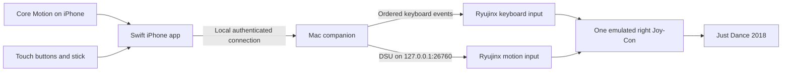

# Motion Air: local Swift controller for Just Dance

Planning baseline: September 7, 2026. This is an implementation plan, not a claim that motion scoring already works.

Implementation progress (September 8, 2026): native probe, bridge motion contract, isolated emulator build and configuration are implemented for testing. See [current implementation and validation status](motion-implementation-status.md) and [device setup](local-device-setup.md). The physical scoring gate remains open. The user subsequently requested full navigation controls and device pairing; those are being developed alongside the proof.


## 1. The intended result

Build a native Swift iPhone controller and a native Swift Mac companion for the user's existing local Ryujinx installation. The iPhone supplies buttons, angular velocity, and acceleration. The Mac presents the input to a locally built Ryujinx as a single right Joy-Con. The user can navigate Just Dance 2018 and dance while holding the phone.

The finished daily workflow should be:

1. Open Motion Air Bridge on the Mac.
2. Open Motion Air on the iPhone and select the remembered Mac.
3. Select the Just Dance profile, hold the phone as illustrated, and calibrate.
4. Open the verified local Ryujinx build and Just Dance.
5. Use the phone's buttons in menus, then enter Dance Mode to prevent accidental touches.
6. Finish a song with live movement reaching the game's scoring system.

Controller traffic stays between the iPhone and Mac. No App Store release, TestFlight distribution, hosted backend, account system, analytics service, public tunnel, or router port forwarding is required for this design. Xcode signing and downloading development dependencies can require internet access. The game's own online services are separate from the controller and are not provided by this project.

## 2. What we have actually established

| Item | Evidence and implication |
| --- | --- |
| iPhone browser buttons | The user confirmed they respond after changing the emulator profile to JoyconRight. This is the working fallback. |
| Controller type | Just Dance's local log advertises Handheld, JoyconLeft, and JoyconRight for the relevant screen. The former ProController preset caused the disconnected-controller problem. |
| Mac keyboard permission | The running bridge reported Accessibility granted during the successful button test. The future Mac app will have its own permission identity. |
| Existing motion transport | The Node bridge contains a DSU/CemuHook server, packet encoder, motion validation, and sensor timestamp handling. Protocol tests exist; this does not establish Just Dance scoring. |
| Existing native client | The Expo client already contains a sensor sender. Keep it as a comparison client while building Swift. Its SDK remains at 54 under app/AGENTS.md. |
| Emulator restriction | The inspected Ryubing 1.3.3 NpadController accepts motion through StandardControllerInputConfig; keyboard-backed input takes a different path. A Swift sensor sender alone does not remove that restriction. |
| Existing patch | tools/ryubing-motion.patch extends keyboard configurations and the CemuHook consumer. It is a starting point that needs review and a real local build, not a validated finished integration. |
| Motion calibration | server/dsu/transform.js defaults to GYRO_GAIN=2.2 and contains a steering-specific gyro sign change. It has only landscape transforms. These are not established dance-controller transforms. |
| Development tools | Xcode 26.6 and Swift 6.3.3 are installed under /Applications/Xcode.app. The shell currently selects /Library/Developer/CommandLineTools, which exposes Swift 6.1.2 and cannot run xcodebuild. |
| Unknowns | Exact iPhone model/iOS, signing-team status, Just Dance motion consumption and scoring, physical grip mapping, sustained wireless performance, and stability of the local emulator patch. |

The first success criterion is **a real song responding to phone movement through a right Joy-Con**, not a connected badge or a moving chart.

## 3. Architecture and migration order

Use two Swift apps in the finished system. Initially connect a small Swift iPhone proof to the existing Node bridge. Replace the bridge only after the emulator and game pass the motion test.



The Mac companion is necessary for the selected input approach. Publishing DSU directly from the phone would still leave button delivery, emulator configuration, and recovery to solve. A direct custom network-input backend inside Ryujinx is a possible later alternative; it is a larger emulator-maintenance commitment and is not required to prove this path.

The result provides the controller features needed here. It does not automatically reproduce HD Rumble, NFC, infrared sensing, or every physical Joy-Con capability. The existing keyboard-backed sticks are digital directions; true analog sticks would require an additional input backend. That limitation is acceptable for the initial dance-and-menu target and should remain visible in broader game profiles.

## 4. Development and local installation

Start with iOS 17+ and macOS 14+ as proposed minimum targets, then confirm the user's iPhone before fixing those values. Use the installed Xcode's Swift 6.3.3; do not base implementation on unreleased language features mentioned in reference material.

Use a per-command developer directory initially:

```bash
DEVELOPER_DIR=/Applications/Xcode.app/Contents/Developer xcodebuild -version
```

This avoids changing the Mac's global developer-tool selection during diagnosis. Confirm that the selected Xcode supports the phone's installed OS before scaffolding device-dependent features.

For the iPhone:

- Install through Xcode using the user's Apple Account and a stable bundle identifier.
- Enable automatic signing, select the actual phone, trust the Mac, and enable Developer Mode if required.
- Use a free Personal Team first if it supports the chosen capabilities. Apple's current Personal Team provisioning expires after seven days, so periodic Xcode reinstall/reprovisioning is part of this route.
- A paid developer membership can reduce that inconvenience but is not the starting requirement. The owner performs any account agreement or purchase.
- Confirm that the app launches after unplugging the USB cable and after the debugger disconnects.

For the Mac:

- Build a normal local .app with a stable bundle identifier and signing identity appropriate to the available account.
- Request Accessibility for the companion itself when using the keyboard bridge. Terminal's existing grant does not transfer automatically.
- Verify local-network permission behavior on the installed macOS; stable code signing matters for permission persistence.
- A local development app does not need App Store submission. Add Login Items support only as an explicit convenience after manual launch works.

Sources: [Apple account and Personal Team guidance](https://developer.apple.com/help/account/basics/about-your-developer-account), [Developer Mode](https://developer.apple.com/documentation/xcode/enabling-developer-mode-on-a-device), [local-network privacy](https://developer.apple.com/documentation/technotes/tn3179-understanding-local-network-privacy).

## 5. Phase 0 — preserve the working baseline

**Estimated effort: half a day.**

1. Record the emulator version and exact executable path. Pin the matching source revision; the inspected 1.3.3 source identified e2143d43bcb6762340d8a01f20e7b5fdf104f02f.
2. Back up Config.json and the working input profiles while Ryujinx is closed. Record the known-working Right Joy-Con setup and button mapping.
3. Capture a short successful browser-button test as the baseline.
4. Record the phone OS, signing setup, Wi-Fi topology, and whether the Mac is on the phone's hotspot. That hotspot worked for button input; discovery and sustained motion still need testing there.
5. Inventory .NET and emulator build prerequisites without upgrading the existing Expo project or replacing the installed emulator.
6. Record checksums and locations for downloaded source/build dependencies. The user has authorized necessary downloads; downloading a dependency does not justify replacing working apps or configurations.

**Exit condition:** the original browser controller can still navigate Just Dance, and there is a clear restore path.

## 6. Phase 1 — prove motion reaches the actual game

**Estimated effort: two to five working days, with the largest uncertainty in this phase.**

### 6.1 Audit and build the emulator extension

- Build a separate local Ryujinx Motion app from pinned source. Verify actual .NET SDK, native-library, package-feed, and signing requirements before using the existing build script.
- Review the build script before running it: it currently resets reused checkout files and removes the destination app directory. Use a fresh task-owned build directory and a new destination. Never run those cleanup operations against an unrelated checkout or an existing working build.
- Preserve the installed stock emulator. Identify and launch the patched executable by exact path. Give the local variant a distinct app identity if required to avoid macOS opening the wrong copy.
- Use a separate configuration root if the pinned build supports it; otherwise use guarded backups and explicit restore. Copy/select existing local emulator resources through supported configuration paths, not by obtaining new game content.
- Review all motion entry points: keyboard motion-config deserialization, NpadController, CemuHook client configuration, and the six-axis state supplied to a single JoyconRight.
- Inspect the existing patch's motion-update condition. It retains an AND comparison between changes to enablement and backend. Test toggling either independently, changing host/port/slot, and removing motion configuration. Initialization and cleanup must respond correctly to each relevant change.
- Do not assume a variable named `_leftMotionInput` means the right Joy-Con is wrong. Follow the actual single-controller versus paired-controller routing into the game's six-axis state.
- Verify that changing or saving settings does not silently remove the added motion section. If the existing Ryujinx settings UI cannot preserve it, document a controlled configuration path or fix that serialization path.
- Disable automatic replacement of this deliberately pinned local build, or make an update explicitly require revalidating/reapplying the patch.

### 6.2 Add an explicit Just Dance preset

The preset should mean: one active player initially; controller type JoyconRight; the already-tested button map; DSU slot 0; localhost motion endpoint; and the verified dance sensor profile.

The current generic setup command defaults to ProController, so it must not be used as the dance preset. The current sideways command can select right Joy-Cons, but it creates two profiles. Add a deliberate one-player preset before the final workflow so an absent second phone is not represented as an always-connected extra player.

While building the preset:

- Refuse configuration writes while Ryujinx runs.
- Back up first, validate the schema, write atomically, and retain unrelated settings.
- Reopen the emulator and verify what it actually loaded from its log and input state.
- Check after game exit and emulator restart as well as immediately after writing JSON.
- Treat the installed version's global-input and raw-keyboard flags according to their source semantics. The source describes them as independent of controller bindings; do not assume both flags alone determine whether a keyboard controller works.

### 6.3 Build a minimal Swift sensor probe

Use one plain screen with Connect, Enable Motion, A, and a small diagnostic display. Manual Mac address is sufficient for this proof. Send the existing bridge's messages so we can test the emulator without simultaneously replacing the server.

Apple Core Motion supplies processed rotation rate, gravity, and user acceleration. The sender should derive the quantities needed by DSU, rather than forwarding an orientation angle and calling it gyro. [Core Motion overview](https://developer.apple.com/documentation/coremotion/cmdevicemotion)

| Quantity | Initial contract |
| --- | --- |
| Angular velocity | Device-frame x/y/z; convert radians per second from Core Motion to degrees per second for the existing DSU path. |
| Acceleration | Include gravity: use `gravity + userAcceleration`, in g, subject to verified coordinate mapping. Do not copy the Expo m/s² conversion into Swift. |
| Timestamp | Sensor sample time, converted from monotonic seconds to integer microseconds; never wall-clock time or packet-arrival time. |
| Sample sequence | Monotonic sequence within a session; new session identity on reconnect. |
| Grip | A fixed, documented physical phone-to-right-Joy-Con orientation. Start with one supported right-hand grip. |
| Sampling | Request 60 Hz first and measure actual callback intervals; evaluate 100 Hz only if tests justify it. |

Core Motion's update interval is a request, not a promise of exact delivery. Sources: [rotation rate](https://developer.apple.com/documentation/coremotion/cmdevicemotion/rotationrate), [user acceleration](https://developer.apple.com/documentation/coremotion/cmdevicemotion/useracceleration), [sensor timestamp](https://developer.apple.com/documentation/coremotion/cmlogitem/timestamp), [motion update interval](https://developer.apple.com/documentation/coremotion/cmmotionmanager/devicemotionupdateinterval).

### 6.4 Correct and validate the sensor transform

- Create a separate Just Dance transform. Begin with physical gain 1.0, not the current 2.2 steering multiplier.
- Establish a documented coordinate basis and unit conversion at every boundary: iPhone, bridge, DSU, Ryujinx, and the emulated right Joy-Con.
- Derive axis signs through physical tests. Do not carry over the Mario Kart roll reversal or add arbitrary sign flips until a chart looks plausible.
- Test all six stationary faces: gravity should have about unit magnitude and move to the expected axis.
- Test positive and negative rotation about each axis, known approximate quarter-turns, slow changes, and quick movements.
- Preserve gravity; calibrate gyro bias only when the phone is stationary. Reset/recenter orientation separately. Do not subtract the entire accelerometer baseline and erase the game's gravity reference.
- Keep attitude/quaternion data for diagnostics initially. The existing DSU path uses acceleration and angular velocity and Ryujinx performs its own orientation calculation; sending Euler angles in gyro fields is incorrect.
- Inspect existing clamping and dead zones against actual measured samples. Record clipping instead of silently compressing strong dance motions.

### 6.5 Run the game test

1. Verify button navigation still works with the new motion-enabled right Joy-Con.
2. Show live sensor samples arriving at the Mac, valid DSU responses, Ryujinx receiving them, and the corresponding six-axis state changing.
3. Select the game's Joy-Con control route and a locally available song.
4. Compare repeated short segments with the phone stationary versus performing the choreography. Record results manually or from local captures, since the bridge does not have a built-in scoring API.
5. Repeat with a physical right Joy-Con if one is available; otherwise explicitly record that there is no hardware reference baseline.
6. Finish at least one song and repeat the run. A single lucky score or a nonzero sensor chart is not sufficient evidence of useful motion tracking.

**Decision gate:** continue the full product build only after Just Dance visibly consumes the live motion and gives repeatable, movement-dependent results. If DSU arrives but scoring stays unchanged, investigate six-axis activation, controller-side selection, units, gravity, orientation, and stale samples. Keep the working menu controller available throughout. A custom Ryujinx network-input driver is a fallback proposal if this route has a demonstrated limitation; it is not an automatic rewrite.

## 7. Phase 2 — build the native iPhone controller

**Estimated effort: three to five working days after the motion proof.**

### Screens and interactions

| Screen | Contents and behavior |
| --- | --- |
| Connect | Discovered/remembered Mac, manual address fallback, optional QR pairing, explicit Connect and current failure reason. |
| Controller | Large A/B/X/Y, Plus/Minus, shoulders, SL/SR where useful, appropriate stick, player identity, connection health, battery, and motion status. |
| Calibration | Illustrated grip, stationary countdown, detected movement during calibration, center/reset action, clear success or retry feedback. |
| Dance Mode | Locked grip orientation, dimmed screen, accidental-touch protection, connection warning, and deliberate press-and-hold exit. |
| Diagnostics | Measured sensor rate, stream age, gyro/acceleration plots, packet statistics, selected transform, and exportable local session report. |
| Settings | English/Spanish, remembered Mac, haptic feedback, grip/profile selection, debug sample rate, and reset pairing. |

Use SwiftUI with small views and `@Observable` session state on the main actor. Use value types for samples, packets, calibration results, and controller state. Use a dedicated serial sensor callback queue as required by Core Motion and a bounded handoff to networking; publish display statistics at about 5–10 Hz instead of redrawing the whole interface per sample. Profile before adding more concurrency or custom rendering.

Include the appropriate `NSMotionUsageDescription`, `NSLocalNetworkUsageDescription`, and declared `NSBonjourServices`, with localized explanations. Add `NSCameraUsageDescription` only when QR scanning is implemented. Check sensor availability and the errors/authorization behavior of the actual Core Motion APIs selected; do not invent a generic permission-request method on CMMotionManager. Verify the local WebSocket probe against the target OS's transport-security rules, and avoid a blanket arbitrary-network-load exception.

Use SwiftUI controls for ordinary settings. For the controller surface, choose SwiftUI gestures or a small UIKit touch surface based on measured multitouch behavior. Every control must release on touch end, cancellation, app inactivity, and disconnect. Test pressing A while moving the stick and holding a shoulder. Labels and packet identifiers remain separate so changing languages cannot remap controls.

### Lifecycle

- The phone app stays active and awake during a dance session; offer dimming inside the app.
- On interruption, backgrounding, screen lock, permission loss, or connection failure, neutralize controls and stop the session safely.
- The Mac also enforces its own timeout because a suspended or terminated app may never send a final release.
- Restore the normal idle timer when the session ends.
- Do not depend on background motion streaming while the Ubisoft controller app is foreground. In this mode, Motion Air itself is the live controller.
- Local haptics confirm taps, pairing, and calibration. Game-driven rumble is a separate return channel and should not be described as implemented by local button vibration.

Use String Catalogs for English and Spanish, preserving the terminology already established in the web interface. Give controls useful accessibility labels, adequate touch targets, and a readable connection recovery state. The hardware screen should remain straightforward; detailed packet information belongs in Diagnostics.

**Exit condition:** the native phone app can perform the proven button-and-motion session on a real phone without Expo Go, Safari, or an attached debugger.

## 8. Phase 3 — build the Swift Mac companion

**Estimated effort: four to seven working days.**

Implement a menu-bar app with a setup/diagnostics window. Port behavior in small verified pieces from the Node server:

- Local listener and paired sessions.
- Controller state and player assignment.
- Ordered keyboard events through the native macOS API, guarded by Accessibility and emulator focus.
- Dead zones, directional hysteresis, and opposing-direction behavior for keyboard-backed sticks.
- Button neutralization on disconnect, app exit, game focus loss, and timeout.
- DSU codec and server, including CRC32, packet sizes, little-endian numbers, timestamp continuity, slot identity, and subscription expiry.
- Verified Ryujinx build/preset selection, backed-up configuration, launch, and status.
- Local session diagnostics and export.

The existing Node codec and tests become a comparison oracle, supplemented by independent known packet fixtures or another DSU implementation. Comparing a Swift encoder only with its own decoder would miss matching mistakes.

### Duplicate-server handling

Address the exact failure already encountered:

1. Enforce one running companion per user/session.
2. Check both the chosen phone-connection port and DSU port before reporting readiness.
3. Identify an existing Motion Air instance and offer to reveal/use it or explicitly replace it.
4. If an unrelated process occupies a port, show the owner and resolution. Do not kill arbitrary processes.
5. Never silently move the phone connection to another port while motion remains bound to the old server.
6. If the user selects a different DSU port, update and verify the emulator endpoint too.

Use explicit states such as: phone connected; motion arriving; DSU listening; emulator subscribed; right Joy-Con configured. A listening socket is not evidence that the game is using motion. Without emulator instrumentation, game-level consumption must be described as unverified.

Retain Node as a selectable development fallback until Swift passes the same input and packet tests. Then normal use becomes opening two apps, without `npm start` or Metro.

**Exit condition:** the Swift companion matches the tested bridge behavior and completes the same real-song test using the native iPhone app.

## 9. Phase 4 — local discovery, pairing, and transport hardening

**Estimated effort: two to four working days; some work can overlap the Mac companion.**

### Connection design

- Use Bonjour discovery through Network.framework; keep manual IP/port entry because hotspot and guest-network behavior varies.
- Declare the selected Bonjour service type and local-network usage description. Request camera access only if the user chooses QR scanning.
- The Mac shows a short pairing code or QR containing a high-entropy local pairing secret and server identity. Confirm the matching session and retain its identity securely.
- Use standard TLS through Network.framework with a local identity verified through pairing; store long-term credentials in Keychain. Do not implement a trust-all certificate callback.
- DSU stays on loopback because it has no application pairing/authentication layer. Authentication on the phone listener must cover both buttons and motion; an IP allowlist is not pairing.
- No internet-facing listener, port forwarding, cloud relay, external account, or telemetry is part of the controller path.

Sources: [Network.framework discovery](https://developer.apple.com/documentation/network/nwbrowser), [networking API selection](https://developer.apple.com/documentation/technotes/tn3151-choosing-the-right-networking-api), and [Apple local-network privacy](https://developer.apple.com/documentation/technotes/tn3179-understanding-local-network-privacy).

### Transport evolution

Start with the existing ordered WebSocket protocol for the feasibility probe. A single ordered stream is the simpler production baseline if it meets measurements.

If packet loss causes TCP backlog or motion blocks button delivery, split a reliable control channel from a freshness-oriented motion channel. Evaluate supported Network.framework transports and their signing/capability requirements; use authenticated motion packets bound to the paired session if selecting UDP. Do not introduce a custom cryptographic protocol.

Define a versioned contract before replacing JSON:

| Field/group | Purpose |
| --- | --- |
| Protocol version and message type | Negotiate compatibility and reject unsupported input. |
| Session ID and player slot | Prevent packets from an old session or another player taking control. |
| Sequence and sensor timestamp | Detect loss/reordering and preserve sample timing. |
| Button state | Preserve ordered presses/releases; reconcile with periodic complete state snapshots. |
| Motion | Six axes, explicit units, grip/transform identifier, and sample quality. |
| Heartbeat/status | Connection liveness, battery, permissions, and emulator readiness. |

Motion should use bounded buffering and discard obsolete samples. Do not replay a backlog of dance movements after Wi-Fi recovers. Protect legitimate short button taps from being erased by motion coalescing.

Suggested starting thresholds, to be measured and tuned:

- At roughly 100–150 ms without a fresh motion sample, stop treating the previous angular velocity as live.
- At roughly 300–500 ms without the input heartbeat, release held buttons.
- Mark the session/slot disconnected according to the protocol and tested game behavior, with a visible recovery state.
- On reconnect, start a new session, clear all held inputs, and re-establish timestamps and calibration state. Never replay old presses.

Account for TCP keepalive connections that remain open after a phone stops sending useful input. Motion freshness requires its own watchdog.

## 10. Phase 5 — physical calibration, performance, and failure tests

**Estimated effort: three to five working days, including user testing.**

The following are proposed acceptance targets, not measured performance claims:

| Area | Acceptance test |
| --- | --- |
| Installation | Launch the iPhone app without the debugger and the Mac app without Terminal. Reprovisioning instructions work for a Personal Team. |
| Buttons | A/B/Plus and navigation work in Just Dance; simultaneous controls work; no stuck input after cancellation or disconnect. |
| Controller identity | The game loads the intended single right Joy-Con before and after restarting Ryujinx; the preset remains intact. |
| Sensor correctness | Approximately 1 g at rest, plausible near-zero stationary gyro, correct signs for all axis tests, monotonic sample time, and recorded clipping diagnostics. |
| Sample timing | Stable measured delivery near the selected 60 Hz target; report gaps and percentiles, not just an average FPS number. |
| Transport latency | Aim for under 50 ms at the 95th percentile from sensor sampling to emulator delivery on the test LAN. Measure it; report emulator frame delay separately. |
| Timing measurement | Do not subtract unrelated phone and Mac clocks. Use round-trip observations and offset estimation with uncertainty; use local timestamps for each stage's processing delay. |
| Packet problems | Inject loss, delay, duplicates, reorder, and a long stall; no stale gyro replay, cross-player packets, or stuck buttons. |
| Recovery | Close/reopen either app, disable Wi-Fi, lock the phone, background the app, change networks, or restart the Mac bridge; recover without corrupting profiles. |
| Motion scoring | Repeat song segments with still and active motion, then complete at least three full songs with visible movement-dependent scoring. |
| Soak | At least a 30-minute session without runaway memory, growing queues, or repeated disconnects; record battery and thermal behavior. |
| Privacy | Run the controller on an isolated LAN after installation; verify no required controller cloud endpoint. Distinguish the game's online traffic. |
| Language | English and Spanish persist and update without reconnecting or changing the input map. |

Use Swift Testing for units, transforms, packet fixtures, state transitions, and malformed-input handling. Use integration tests for ordered button handling, timeout neutralization, DSU interoperability, and profile backup/restore. Use XCUITest for normal app flows. Real sensors, wireless behavior, dancing, and emulator scoring require the physical iPhone and live game; Simulator cannot establish those results.

Record short diagnostic traces locally with an explicit capture control. Default to a bounded in-memory buffer; exports should omit pairing secrets and avoid indefinite raw motion retention.

## 11. Repository layout and deliverables

Proposed additions, keeping the working web and Expo clients intact during migration:

```text
native/
  MotionAir.xcworkspace
  iOS/MotionAir/
    App/
    Connection/
    Controller/
    Motion/
    Calibration/
    Diagnostics/
    Resources/Localizable.xcstrings
  macOS/MotionAirBridge/
    App/
    Sessions/
    Keyboard/
    DSU/
    Ryujinx/
    Diagnostics/
  Packages/JoypadCore/
    Sources/
    Tests/
tools/
  ryujinx-build/                 # reviewed, reproducible local build workflow
  ryubing-motion.patch          # audited and pinned emulator changes
docs/
  swift-local-just-dance-plan.md
  local-device-setup.md
  motion-coordinate-contract.md
  just-dance-validation.md
```

JoypadCore should contain platform-independent value types, packet encoding, transforms, calibration math, and fixtures. Avoid sharing UI or Apple-specific permission code through this package. UI state belongs on the main actor; reusable codec and math APIs should not acquire global main-actor isolation.

Deliverables at completion:

1. Xcode workspace that builds on this Mac.
2. Development-signed iPhone app installed on the user's phone.
3. Local Swift Mac companion with discovery, pairing, diagnostics, and recovery.
4. Separately identifiable local Ryujinx Motion build, pinned source, and reproducible patch/build instructions.
5. Verified Just Dance right-Joy-Con preset with backup and restore.
6. English/Spanish app text and practical local installation/reprovisioning instructions.
7. Test results, physical sensor traces, and recorded in-game validation, including any remaining limitations.

## 12. Effort and order of work

| Milestone | Rough active engineering effort | Dependency |
| --- | --- | --- |
| Preserve baseline and verify device/tooling | 0.5 day | None |
| Patched emulator plus minimal Swift motion proof | 2–5 days | Baseline |
| Native iPhone controller and calibration flow | 3–5 days | Game-motion gate passes |
| Native Mac bridge | 4–7 days | Proven protocol and sensor contract |
| Discovery, pairing, transport hardening | 2–4 days | Working native client and bridge |
| Physical testing, recovery, documentation | 3–5 days | Integrated system |

These are planning estimates for one developer with iterative agent assistance and access to the actual phone. They suggest roughly three to six working weeks for a complete local system, with a decision on core feasibility much earlier. Broken emulator dependencies or a game-level motion mismatch can increase the estimate; UI work is not the main uncertainty.

The next implementation milestone should be narrow: **a minimal Swift iPhone app sends real motion through the existing bridge to a separately built Ryujinx, and Just Dance scores a real movement test using one right Joy-Con.** Once that is verified, proceed to the full native applications.

## 13. Boundaries and known risks

- This work supplies local controller input. It does not recreate Nintendo or Ubisoft servers or guarantee the old Just Dance Controller app's network service.
- If Motion Air is the motion source, it must remain the active phone app during play. The earlier browser-for-menus plus Ubisoft-app workflow is a different mode.
- Just Dance scoring is a physical integration test. We can aim for useful playability; equivalent scoring to a genuine Joy-Con is not established in advance.
- The iPhone's mass, shape, sensor position, and grip differ from a Joy-Con. Document a secure grip or suitable strap/case for actual dance testing and avoid accidental touch input.
- Full right-Joy-Con behavior, motion packet receipt, and game scoring are separate milestones. The interface and reports must not collapse them into one misleading green status.
- Two-player support follows stable one-player scoring. DSU slots already provide a starting point, but that does not prove the complete two-player game flow or eliminate keyboard-backend limitations.
- Rollback remains available: the stock emulator and working local browser controller are retained until the replacement passes validation.

Implementation reference for the inspected emulator restriction: [Ryubing 1.3.3 NpadController](https://git.ryujinx.app/ryubing/ryujinx/raw/tag/1.3.3/src/Ryujinx.Input/HLE/NpadController.cs). Local evidence and the current patch are in this repository; the patch's presence is not evidence of a successful game-motion test.
